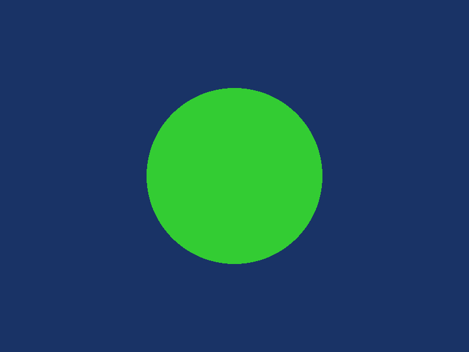
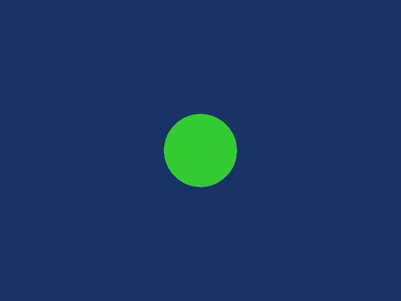
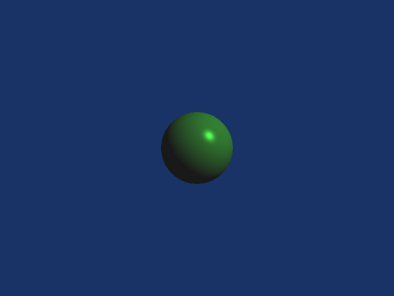
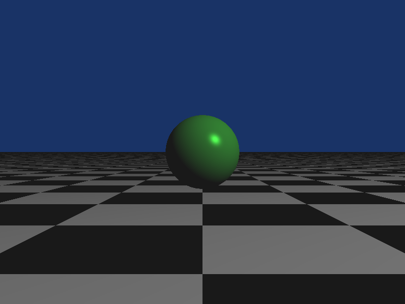
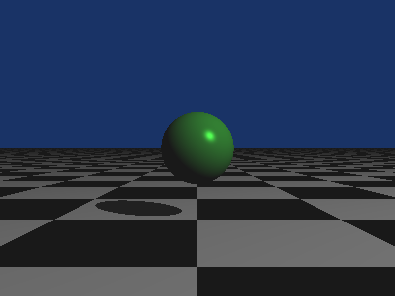
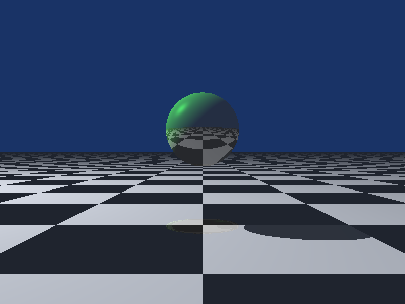

# Ray fragment shader

Raycasting and raytracing methods implements with GLSL

## How to run these shaders ?

You can use glslViewer if you want to run these shaders immediately. There is a submodule to do that in this project. Also, you can use it in your own GLSL program.

`glslviewer <shader_name>.frag -w 800 -h 600`

## Circle

`circle.frag`

This shader shows you how to switch between screen coordinate and world coordinate in 2D. Then, it just draws a circle.

## Sphere

`sphere.frag`

This shader shows you how to use a 3D aspect in a fragment shader, with a simple ray casting method. Theoretically, it draws a sphere in three-dimensional space. But it looks like a circle because there is no light anymore.

## Phong

`phong.frag`

This shader is similar to the previous one and adds the Phong shading light. The sphere takes a material component with ambient, diffuse and specular coefficients. Furthermore, we place a light in the world space.

## Plane

`plane.frag`

This shader adds a plane below our ball. Here we compute all rays intersection on the plane before the ball, because we don't take in consideration the nearest intersection.

## Shadow

`shadow.frag`

We finally compute the nearest intersection and we can now get a shadow factor on this intersection. This shadow factor will be use when we compute the Phong shading light.

## Raytracing

`raytracing.frag`

In this shader, when we draw the scene, the materials obtained during a reflection are saved. Then we determine the color according to the specular coefficient and the color of the different materials encountered by the ray. The sphere and the light are animated, by the way.

